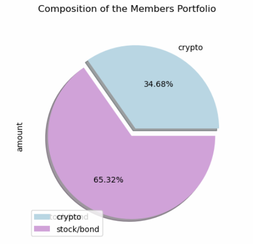
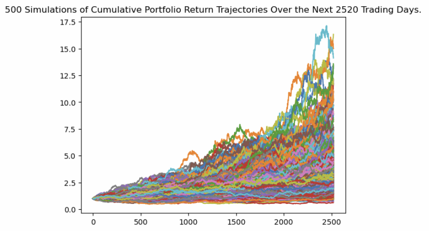
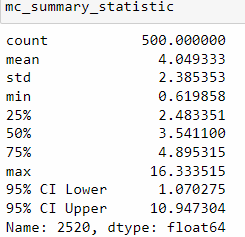
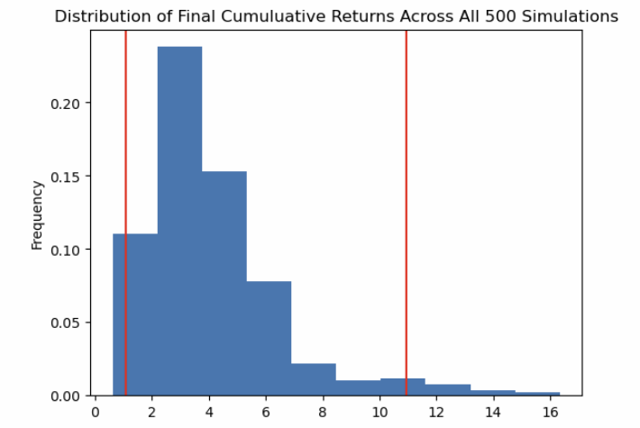

# Financial Planning with APIs and Simulations   
---
In this project, I decide to launch a tech consulting firm focused on projects benefiting local communities and secured the first contract with a large credit union. The project involves creating a tool to help credit union members evaluate their financial health by assessing their monthly budgets and forecasting effective retirement plans based on their current holdings of cryptocurrencies, stocks, and bonds. The goal is to develop a prototype application for the credit union's CTO to present at the next assembly.


## Technologies

1. Daily Returns
   1. 
   2. 
   3.
2. 
   1. 
   2.  
      > 
3. Rolling Data
   1. 
   2. 
   3.  
      > 
---

## Installation Guide

```python
# To run this analysis, you need serveral libraries from Python, such as Pandas, matplotlib, and requests
import os
import requests
import json
import numpy as np
import pandas as pd
from dotenv import load_dotenv
import alpaca_trade_api as tradeapi
from MCForecastTools import MCSimulation
```

---
## Usage

#### Description
This project involves developing a financial health assessment tool for a large credit union. The tool will enable credit union members to evaluate their monthly budgets and forecast effective retirement plans based on their current holdings of cryptocurrencies, stocks, and bonds. The goal is to create a user-friendly prototype application that the credit union's CTO can present at the upcoming assembly, demonstrating its potential to improve financial planning and well-being for the members.
  
#### Processing
**This chart displays the distribution of crypto and stock portfolio**   
> This specific customer prefers to invest a retire plan effectively that distribute the budget for investing crypto currency and stock/bond.   
   
**Using Monte Carlo to Create a Prototype application**   
* Using Monte Carlo to create 500 different simulations
* This graph displays prediction for 10 years 
   
**Statistic Analysis**   
* Running 500 simulations
* For the best case, customer will earn 16.3 times of the investment after 10 years
* For the worst case, customer will get 0.62 of the original investment
* For average, customer will earn 4.05 times of the original investment
* `There is a 95% of chance`, customer will earn between 1.07 and 10.95 times of the original investment
* There is 75% of chance, customer will earn 2.48 times and more
   
**Histogram**   
* There is a 25% of chance that the customer will earn 2 to 3.5 times
* There is a 15% of chance that the customer will earn 3.5 to 5 times
* There is a 7% of chance that the customer will earn 5 to 7 times
* There is a 47% of chance that the customer will earn between 2 to 7 times
   

---

## Contributors

Shu Liu   
shu@liu.net

---

## License

MIT License

Copyright (c) 2024 Shu

Permission is hereby granted, free of charge, to any person obtaining a copy
of this software and associated documentation files (the "Software"), to deal
in the Software without restriction, including without limitation the rights
to use, copy, modify, merge, publish, distribute, sublicense, and/or sell
copies of the Software, and to permit persons to whom the Software is
furnished to do so, subject to the following conditions:

The above copyright notice and this permission notice shall be included in all
copies or substantial portions of the Software.

THE SOFTWARE IS PROVIDED "AS IS", WITHOUT WARRANTY OF ANY KIND, EXPRESS OR
IMPLIED, INCLUDING BUT NOT LIMITED TO THE WARRANTIES OF MERCHANTABILITY,
FITNESS FOR A PARTICULAR PURPOSE AND NONINFRINGEMENT. IN NO EVENT SHALL THE
AUTHORS OR COPYRIGHT HOLDERS BE LIABLE FOR ANY CLAIM, DAMAGES OR OTHER
LIABILITY, WHETHER IN AN ACTION OF CONTRACT, TORT OR OTHERWISE, ARISING FROM,
OUT OF OR IN CONNECTION WITH THE SOFTWARE OR THE USE OR OTHER DEALINGS IN THE
SOFTWARE.
